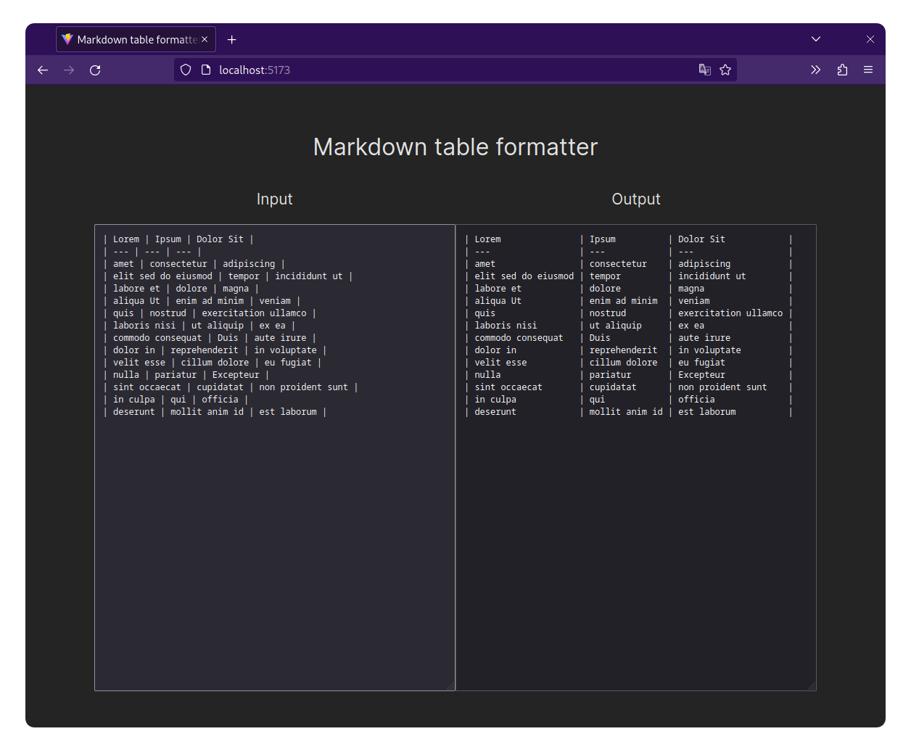

# Markdown table formatter
When you just need to format that damned markdown table

## How to build it
1. Install node.js
2. Clone this repo and run `npm install`
3. Run `npm run build` to build it. The files will be in the `dist` directory
4. To preview it, run `npm run preview`
